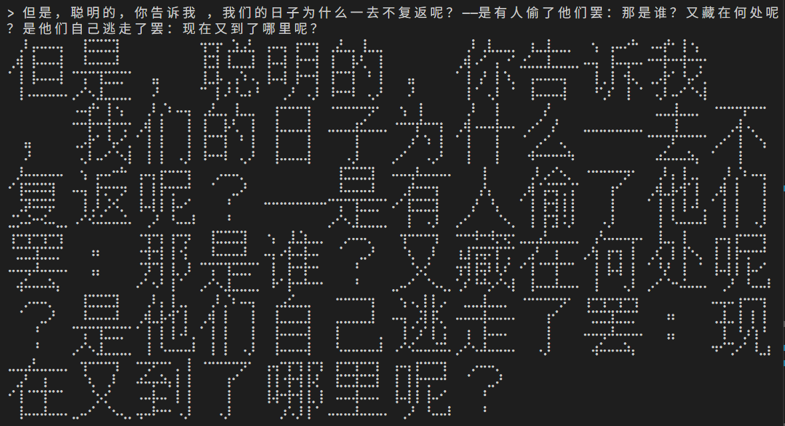

# 基于 Unifont 生成的简体中文 FIGlet 字体


## 简介

由于没有一个自己喜欢的简体中文 ASCII 艺术字（也很少），而且自己不会设计字体，所以想到利用一种点阵字体来自动生成 ASCII 艺术字。

这个程序使用 [Unifont](https://unifoundry.com/unifont/) 来生成（主要是简体中文的） FIGlet 字体。  
如果您加以改动，可以把 Unifont 内任何字形都转换为 FIGlet 字体。

## 说明

`generate.py` 是主要的程序，可以用来生成 `.flf` 字体文件。  

生成的 `.flf` 字体文件不宜过大，否则 FIGdriver 读取太慢了，因此有方法控制字形范围。  
可以通过更改内部 `FLF_SCOPE_ARR` 变量来控制生成的额外的 FIGlet 字形范围，即除去 [`U+0020-U+007E`, `U+00C4`, `U+00D6`, `U+00DC`, `U+00E4`, `U+00F6`, `U+00FC`, `U+00DF`] 的必须字符之外（详见 <http://www.jave.de/figlet/figfont.html#requiredfigchar>）的字形范围。*格式为 `[[start, stop]]`。*  
通过更改 `assets/level-1.txt`（3500 个，未改动的一级字表，基本是不能删的了）来控制生成的码位不连续的字形（简中字符，或者你任何想要的字符）；  
或者更改代码里的 `INPUT_SP_CHINESE_CH_FILE` 为 `assets/gb2312-chinese.origin.txt`/`assets/gb2312-chinese.modify.txt`。

- `assets/level-1.txt`: 3500 个，未改动的一级字表，基本是不能删的了；
- `assets/gb2312-chinese.modify.txt`: 是我从 GB2312 简体中文字符集里删掉一堆不常用字而来的；
- `assets/gb2312-chinese.origin.txt`: 6763 个，是原本的 GB2312 简体中文字符集，方便比较删去的字形；
  - *以上三个文件的格式都是一行一个字符。*
- `assets/removed-level3.txt` 是三级字表，方便确定最好要删去的字形。

`assets/unifont/` 下是 Unifont 的 `.hex` 文件（`assets/unifont/unifont.json` 是程序生成的），版本号参见 `generate.py` 内的 `UNIFONT_VERSION` 常量。

生成的字体均在 `fig-fonts` 目录下。

`test-font.py` 可以测试生成的 FIGlet 字体，自动复制。其实也是本地使用该 FIGlet 字体的一种方式。  
（您应该确保已运行 `pyfiglet -L <name.flf>`，即想要使用的 FIGlet 字体文件已在 `<package_folder>/pyfiglet/fonts/` 下）

## 字体风格

有 13 种字体风格：

<details>
<summary><code>ch_filling</code> => <code>solid_box_big</code>(2.92MiB, 3'072'821Bytes):</summary>

这个字体文件是比较大的。  
在等宽字体下才能显示正常。

```
          ██      ██                                                          ██                
██████████████████████████████    ████████████████████████                    ██                
          ██      ██                                  ██                      ██                
          ██      ██                                ██              ██████████████████████      
      ██  ██████████  ██                          ██                          ██                
      ██              ██    ██                ████                            ██                
████████              ██████                  ██                              ██                
      ██  ██████████  ██        ██████████████████████████████                ██                
      ██  ██      ██  ██                      ██                ██████████████████████████████  
    ████  ██      ██  ██    ██                ██                            ██                  
████  ██  ██████████  ██    ██                ██                            ██                  
      ██                ██████                ██                          ██                    
                                              ██                        ██          ██          
  ██    ██      ██      ██                    ██                      ██              ██        
  ██      ██      ██      ██              ██  ██                    ██████████████████████      
██        ██      ██      ██                ██                                          ██      
                                                                            ██                  
  ████████████████████████                                                  ██                  
                      ██                                        ██████████████████████████████  
                    ██                                                    ██                    
                  ██                                                      ██                    
              ████                                                      ████████████████        
              ██                                                        ██            ██        
              ██                                                      ████            ██        
              ██                                                    ██  ████████████████        
              ██                                                  ██    ██            ██        
              ██                        ████                    ██      ██            ██        
              ██                        ████                            ████████████████        
              ██                          ██                            ██            ██        
              ██                          ██                            ██            ██        
          ██  ██                        ██                              ██        ██  ██        
            ██                                                          ██          ██          
                                              ██                      ██          ██            
██████████████████████████████                ██                      ██          ██            
              ██                              ██                    ██            ██            
              ██                  ██████████████████████████      ████████████    ██████████    
    ██████████████████████                    ██                  ██        ██  ██        ██    
    ██        ██        ██            ██      ██      ██          ██        ██  ██        ██    
    ██        ██        ██              ██    ██      ██          ██        ████          ██    
    ██████████████████████              ██    ██    ██            ██        ██    ██      ██    
    ██        ██        ██      ██████████████████████████████    ████████████      ██    ██    
    ██        ██        ██                  ██████                ██        ██      ██    ██    
██████████████████████████████            ██  ██  ██              ██        ██            ██    
    ██                  ██              ██    ██    ██            ██        ██            ██    
    ██                  ██          ████      ██      ████        ██        ██            ██    
    ██                  ██      ████          ██          ████    ████████████            ██    
    ██              ██  ██                    ██                  ██        ██      ██  ██      
    ██                ██                      ██                                      ██        
                        ██            ██                                                        
                        ██            ██    ██████████████                                      
  ██████████            ██            ██                ██                                      
  ██      ██            ██          ██  ██              ██                                      
  ██      ██  ████████████████      ██  ██████████████████████                                  
  ██      ██            ██        ████  ██    ██                          ████                  
  ██      ██            ██        ████  ██    ██                          ████                  
  ██████████            ██      ██  ██  ██  ██████████████                                      
  ██      ██    ██      ██          ██  ████      ██                                            
  ██      ██      ██    ██          ██  ██        ██                                            
  ██      ██      ██    ██          ██  ██████████████████████            ████                  
  ██      ██            ██          ██  ██        ██                      ████                  
  ██████████            ██          ██  ██      ██  ██                      ██                  
  ██      ██            ██          ██        ██      ██                    ██                  
                    ██  ██          ██      ██          ██                ██                    
                      ██            ██  ████              ████                                  
```

英文：

```
                                                                                                                
                                                                                                                
                                                                                                                
                                                                  ██                                            
    ██████████                                        ██          ██                                  ██        
        ██                                            ██          ██                                  ██        
        ██        ██  ██████                          ██          ██  ██████        ████████          ██        
        ██        ████      ██                    ██████████      ████      ██    ██        ██    ██████████    
        ██        ██        ██                        ██          ██        ██              ██        ██        
        ██        ██        ██                        ██          ██        ██      ██████████        ██        
        ██        ██        ██                        ██          ██        ██    ██        ██        ██        
        ██        ██        ██                        ██          ██        ██    ██        ██        ██        
        ██        ██        ██                        ██          ██        ██    ██      ████        ██        
    ██████████    ██        ██                          ████      ██        ██      ██████  ██          ████    
                                                                                                                
                                                                                                                
                                                                                                                
                                                                                                                
                                                                                                                
                                                                                                                
                                                                                                                
                                                                                                                
                    ████████        ████████        ████████        ████████                                    
                  ██        ██    ██        ██    ██        ██    ██        ██                                  
                  ██                        ██    ██              ██        ██                                  
                  ██                ██████████      ████          ████████████                                  
                  ██              ██        ██          ████      ██                                            
                  ██              ██        ██              ██    ██                                            
                  ██        ██    ██      ████    ██        ██    ██        ██        ████                      
                    ████████        ██████  ██      ████████        ████████            ██                      
                                                                                        ██                      
                                                                                      ██                        
```

</details>

<details>
<summary><code>ch_half_block</code> => <code>solid_box_small</code>(968KiB, 991'289Bytes):</summary>

在等宽字体下才能显示正常。

```
   █   ▄▄▄▄▄▄      █    ▄          █      █      ▄▄▄▄▄▄▄▄▄▄▄▄                         █         
   █      ▄▀       █  █▀ ▄ █▀▀█    █      █               ▄▀                    ▀▀▀▀▀█▀▀▀▀▀▀▀▀▀ 
▀▀▀█▀▀  ▄▀      ▀▀▀█▀▀█  █ █  █ ▀▀▀█▀▀ ▀▀▀█▀▀▀▀        ▄▄▀                          ▄█▄▄▄▄▄▄    
  ██▄  ▀█▀▀█▀▀█   ██▄ █  █ █  █   ██▄     █            █                           ▄█      █    
 █ █ █  █  █  █  █ █ ▀█ ▄█ █  █  █ █ █ █▀▀▀▀▀█         █                         ▄▀ █▀▀▀▀▀▀█    
▀  █   █  ▄▀  █ ▀  █  █▀ █ █▀▄▀ ▀  █   █     █         █            ██          ▀   █▄▄▄▄▄▄█    
   █ ▄▀  ▄▀   █    █    █  █       █   █     █         █             █              █      █    
   █   ▄▀  ▀▄▀     █  ▄▀   █       █   █▀▀▀▀▀█       ▀▄▀            ▀               █    ▀▄▀    
▄▄▄▄▄▄▄▄▄▄▄▄▄▄▄        █           █     █                  █      █  ▄▄▄▄▄▄▄                   
       █         ▀▀▀▀▀▀█▀▀▀▀▀▀   ▄█▄▄▄▄  █▄▄▄▄   █▀▀▀█      █     ▄▀▄       █                   
  █▀▀▀▀█▀▀▀▀█     ▀▀▀▀▀█▀▀▀▀▀    █    █ █    █   █   █ ▀▀▀▀▀█▀▀  ▄█ █▀▀█▀▀▀▀▀▀▀      ▄▄         
  █▄▄▄▄█▄▄▄▄█   ▀▀▀▀▀▀▀▀▀▀▀▀▀▀▀  █    █▀ ▄   █   █▄▄▄█      █   ▄▀█ █ ▄█▄▄▄▄▄        ▀▀         
  █    █    █      █▀▀▀▀▀▀▀█     █▀▀▀▀█   █  █   █   █  ▀▄  █     █ █▀   █                      
▀▀█▀▀▀▀▀▀▀▀▀█▀▀    █▀▀▀▀▀▀▀█     █    █      █   █   █   ▀  █     █ █▀▀▀▀█▀▀▀▀▀      ██         
  █         █      █▀▀▀▀▀▀▀█     █▄▄▄▄█      █   █▀▀▀█      █     █ ▀  ▄▀ ▀▄          █         
  █       ▀▄▀      █     ▀▄▀     ▀    ▀   ▀▄▀             ▀▄▀     █ ▄▄▀     ▀▄▄      ▀          
```

英文：

```
                                                                
                         ▄                                      
 ▀▀▀█▀▀▀                 █                                      
    █    ▄▀▀▀▀▄          █▄▀▀▀▄  ▄▀▀▀▀▄          ▄▀▀▀▀▄  █▄▀▀▀▄ 
    █    █    █          █    █  █▄▄▄▄█          █    █  █    ▀ 
    █    █    █          █    █  █               █    █  █      
    █    ▀▄▄▄▄▀          █▀▄▄▄▀  ▀▄▄▄▄▀          ▀▄▄▄▄▀  █      
                                                                
```

</details>

<details>
<summary><code>ch_braille_dots</code> => <code>braille_dots</code>(421KiB, 431'769Bytes):</summary>

在盲文字符为等宽的字体下才能显示正常，所以下面显示的可能不对劲。  
在终端中显示一定正常。

```
⠀⢀⠇⡤⠤⠤⢤⠀⠀⢸⣉⣉⣉⣹⠀⠀⠀⠀⠀⠀⠀⠀⠀⠀⢲⠒⡖⢀⣱⣠⣃⠀⢠⠤⢤⠀⡖⠒⢲⠀⢀⣜⣀⡀⢸⣀⣀⠀⠀⠀⠀⠀⠀⠀⠀⠀⠀⢀⠇⢀⣇⣀⣀⡀⠀⢰⣀⣸⣀⣀⡀⠀⠀⢢⠀⢠⠤⠔⠓⠀⠠⠤⡞⠂⢸⠐⡄⠀
⢀⢾⠀⡧⠤⠤⢼⠀⠀⠸⠤⠤⠤⠼⠀⠀⠀⠀⠀⠀⠀⠀⠀⠀⢸⣉⡇⢸⣀⣀⣸⠀⢸⠤⢼⠀⡗⠒⢺⠀⢸⠀⠀⡧⢃⠀⢸⠀⠀⠀⠀⠀⠀⠀⠀⠀⢀⢾⠠⠊⠀⡄⠐⠁⣐⣁⣀⣸⣀⣀⣀⡀⠤⢤⠀⢸⠤⢤⠤⠄⠒⠒⡗⠒⢺⠒⢒⠂
⠁⢸⠀⡧⠤⠤⢼⠀⠉⢩⠉⢹⣉⣉⡉⠁⠀⠀⣤⠀⠀⠀⠀⠀⢸⣀⡧⢀⢠⠱⠠⡀⢸⠤⢼⠀⡗⠒⢺⠀⢸⠉⠉⡇⠀⠃⢸⠀⠀⠀⣤⠀⠀⠀⠀⠀⠁⢸⠀⡜⠀⡇⠱⡀⠀⢠⠤⠤⠤⢤⠀⠀⠀⢸⢀⢸⠀⢺⢄⠀⢀⡠⡗⠁⠘⡤⠊⡀
⠀⢸⠠⠤⠤⠤⠤⠄⡠⠊⠢⣸⣀⣀⣀⡀⠀⠀⠜⠀⠀⠀⠀⠀⠉⠀⡇⠜⠘⠤⠆⠃⠀⠀⢀⠜⠀⠠⡸⠀⠸⠒⠒⠇⠀⢄⠜⠀⠀⠀⠜⠀⠀⠀⠀⠀⠀⢸⠈⠀⢄⠇⠀⠁⠀⢸⠤⠤⠤⢼⠀⠀⠀⠘⢁⠎⠀⢸⠀⠁⠀⢄⠇⠤⠊⠈⠢⡇
⠀⠀⠀⠀⠀⠀⠀⠀⠠⠤⡞⠂⢸⠐⡄⠀⠀⢀⠇⡈⠆⠤⢤⠀⢀⣜⣀⡀⢸⣀⣀⠀⠀⢰⠒⠒⠒⢲⠀⠀⠐⠒⠒⠒⠒⡲⠂⠀⠀⢢⠀⢸⠀⠀⠀⠀⠀⢀⠇⠀⠀⡇⠀⠀⠀⠀⠀⡜⠀⠀⠀⠀⠀⠀⠀⠀⠀⠀⠀⠀⠀⣀⣀⣸⣀⣀⡀⠀⠐⠒⠒⠒⡖⠒⠒⠀
⠀⠀⠀⠀⠀⠀⠀⠀⠒⠒⡗⠒⢺⠒⢒⠂⢀⢾⠀⡇⠀⠀⢸⠀⢸⠀⠀⡧⢃⠀⢸⠀⠀⢸⣀⣀⣀⣸⠀⠀⣀⣀⣀⣰⣊⣀⣀⡀⠐⠒⠒⡞⠒⠒⡆⠀⢀⢾⠠⠤⠤⡧⠤⠄⠀⡠⠊⠀⡜⠀⠀⠀⣀⣀⣀⣀⣀⣀⣀⡀⠀⠀⠀⢸⠀⠀⠀⠀⠀⠀⢀⢼⠠⡀⠀⠀
⠀⠀⣤⠀⠀⠀⠀⠀⢀⡠⡗⠁⠘⡤⠊⡀⠁⢸⠀⡇⠀⠀⢸⠀⢸⠉⠉⡇⠀⠃⢸⠀⠀⢸⠀⠀⠀⢸⠀⠀⠀⠀⠀⢸⠀⠀⠀⠀⠀⠀⡰⠁⠱⠀⡇⠀⠁⢸⠀⠀⠀⡇⠀⠀⠈⠀⡠⠊⠀⢄⠀⠀⠀⠀⠀⠀⠀⠀⠀⠀⠉⠉⢉⠏⠉⠉⠉⠁⢀⠔⠁⢸⠀⠈⢢⠀
⠀⠀⠜⠀⠀⠀⠀⠀⠀⢄⠇⠤⠊⠈⠢⡇⠀⢸⠀⡇⠀⠠⡸⠀⠸⠒⠒⠇⠀⢄⠜⠀⠀⢸⠤⠤⠤⢼⠀⠀⠀⠀⠠⡸⠀⠀⠀⠀⡠⠊⠀⠀⠠⡠⠃⠀⠀⢸⠀⠀⠀⡇⠀⠀⠀⠺⠒⠒⠒⠒⠳⠀⠀⠀⠀⠀⠀⠀⠀⠀⠀⠴⠥⠤⠤⠵⡄⠀⠁⠀⠀⢸⠀⠀⠀⠀
⠀⡸⠤⠤⠤⠤⠤⠀⠀⢢⠀⡤⠤⠒⠓⠀⢠⠤⡄⡖⠒⠒⢲⠀⠀⠀⡠⠤⠤⡀⠀⠀⠀⠀⠀⠀⠀⠀⠀⠀⠀⢸⣉⣉⣉⣹⠀⠀⠤⠤⢤⠧⠤⠤⠤⠄⠀⠀⠀⢸⠀⠀⠀⠀⠀⢀⠇⡠⠊⠢⡀⠀⠐⠒⠒⠒⠒⡲⠂⠀⠀⢀⠇⡄⢸⢀⡀⠀⠀⢀⠇⡈⠆⠤⢤⠀
⠊⢸⠭⠭⠭⢽⠀⠀⠤⢤⠀⡗⡒⠒⡲⠀⢸⠀⡇⡗⢒⠒⠚⠀⠀⠈⠀⠀⣀⠜⠀⠀⠀⠀⠀⠀⠀⠀⠀⠀⠀⠸⠤⠤⠤⠼⠀⠀⠀⢀⡞⠒⠒⢲⠀⠀⠀⠀⠀⡜⡄⠀⠀⠀⢀⢾⠈⡬⢭⢉⢨⠁⠀⠀⠀⢰⠊⠀⠀⠀⢀⢾⣀⡧⢺⠁⡇⠀⢀⢾⠀⡇⠀⠀⢸⠀
⠀⢈⡽⠭⠭⡭⠀⠀⠀⢸⢀⠇⡨⠪⡀⠀⢸⠤⡇⡇⢸⠤⠊⠀⠀⠀⠀⠘⠀⠀⠀⠀⠒⠒⠒⠒⠒⠒⠒⠒⠉⢩⠉⢹⣉⣉⡉⠁⠔⠁⣏⣉⣉⣹⠀⠀⠀⠀⡜⠀⠘⡄⠀⠀⠁⢸⠀⡗⢺⢸⢸⠀⠀⠀⠀⢸⠀⠀⠀⠀⠁⢸⠀⡇⢸⠠⠇⡀⠁⢸⠀⡇⠀⠀⢸⠀
⣈⡡⠬⠒⠪⠤⣀⡀⠠⠊⠪⠬⠤⠤⠬⠄⠀⢀⠜⠀⠘⠤⠤⠇⠀⠀⠀⠘⠀⠀⠀⠀⠀⠀⠀⠀⠀⠀⠀⠀⡠⠊⠢⣸⣀⣀⣀⡀⠀⠀⡇⠀⠠⡸⠀⠀⡠⠊⠀⠀⠀⠈⠢⡀⠀⢸⠀⡏⣹⠨⡸⠀⠀⠀⠠⡸⠀⠀⠀⠀⠀⢸⠀⠣⠤⠤⠤⠇⠀⢸⠀⡇⠀⠠⡸⠀
⢰⠒⢲⠒⢲⠒⢲⠀⠀⠀⠀⠀⠀⠀⠀⠀⠐⢲⠒⡆⢰⠒⡲⠀⠀⢸⣉⣉⣉⣹⠀⠀⠐⡄⠀⣸⣈⣆⣀⡀⠀⠀⡠⠤⠤⡀⠀⠀⠀⢲⠒⠒⠒⢲⠀⠀⠒⠒⠺⠒⠺⡒⢖⠂⣀⣀⣠⣃⣀⣀⣀⡀⠀⢠⠣⠤⠤⠤⡤⠄⠀⢸⣀⡀⢸⠀⠀⠀⢠⠤⡄⡖⠒⠒⢲⠀
⠈⣉⣉⣹⣉⣉⡉⠀⠀⠀⠰⠆⠀⠀⠀⠀⠐⢺⠒⡇⢸⠐⡅⠀⠀⠸⠤⠤⠤⠼⠀⠀⠤⡄⠔⡧⠤⡧⠤⠀⠀⠈⠀⠀⣀⠜⠀⠀⠀⠈⢆⠀⢀⠇⠀⠀⢰⣸⢩⢭⠍⡏⢉⠁⠀⣠⠃⠀⢰⠀⠀⠀⡠⢳⠀⡖⢲⠀⡇⠀⢀⢎⠀⡇⢸⠑⢄⠀⢸⠀⡇⡗⢒⠒⠚⠀
⠤⠤⢤⠼⠤⠤⠤⠄⠀⠀⢠⡄⠀⠀⠀⠀⠈⡹⠉⡇⢸⡀⡸⠀⠉⢩⠉⢹⣉⣉⡉⠁⠀⡇⠀⡗⠒⡗⠒⠀⠀⠀⠀⠘⠀⠀⠀⠀⠀⠀⠈⡢⡊⠀⠀⠀⢲⢺⢸⢭⠇⢇⠎⠀⠊⢸⠈⠉⢹⠉⠉⠀⠀⢸⠀⡧⢼⠀⡇⠀⠁⠘⡜⠀⢸⠀⠈⠀⢸⠤⡇⡇⢸⠤⠊⠀
⠀⢴⠥⠤⠤⠵⡄⠀⠀⠀⠀⠀⠀⠀⠀⠀⠔⠁⠢⠃⢸⠈⠀⠀⡠⠊⠢⣸⣀⣀⣀⡀⠀⠗⠁⡗⠒⠓⠒⠂⠀⠀⠀⠘⠀⠀⠀⠀⣀⠤⠊⠀⠈⠢⢄⡀⢁⠎⠘⠚⡢⠊⠢⡇⠀⢸⠤⠤⠼⠤⠤⠄⠀⢸⠀⠀⠀⢄⠇⠀⡠⠊⠈⠒⠬⠤⠤⠄⠀⢀⠜⠀⠘⠤⠤⠇
⠀⠀⡠⠤⠤⡀⠀⠀⠀⢸⣉⣉⣉⣹⠀⠀⠀⢀⠇⡄⢸⢀⡀⠀⠀⢀⠇⡈⠆⠤⢤⠀⠀⢀⣠⣊⣀⣀⠀⠀⠀⠒⠒⠒⠒⢲⠀⠀⠀⢢⠠⡀⡇⡇⡠⠀⠀⣀⣀⣸⣀⣀⡀⠀⠐⠒⠒⠒⠒⡲⠂⠀⢰⠒⢲⠒⢲⠒⢲⠀⠀⠀⠀⠀⠀⠀⠀⠀⠤⢤⠤⢰⠒⠒⢲⠀
⠀⠈⠀⠀⣀⠜⠀⠀⠀⠸⠤⠤⠤⠼⠀⠀⢀⢾⣀⡧⢺⠁⡇⠀⢀⢾⠀⡇⠀⠀⢸⠀⠀⢸⣀⣀⣀⣸⠀⠀⠀⣀⣀⣀⣀⣸⠀⠀⠤⢤⠀⡨⡇⡯⡀⠀⠤⠤⠤⢼⠤⠤⠤⠄⠀⠀⠀⢰⠊⠀⠀⠀⠈⣉⣉⣹⣉⣉⡉⠀⠀⠀⠰⠆⠀⠀⠀⠀⢀⣸⣀⢸⠀⡇⢸⠀
⠀⠀⠀⠘⠀⠀⠀⠀⠉⢩⠉⢹⣉⣉⡉⠁⠁⢸⠀⡇⢸⠠⠇⡀⠁⢸⠀⡇⠀⠀⢸⠀⠀⢸⠤⠤⠤⢼⠀⠀⠀⡇⠀⠀⠀⠀⢀⠀⠀⢸⠈⡰⠁⡇⢨⠀⠀⢰⠀⢸⠤⠤⠄⠀⠀⠀⠀⢸⠀⠀⠀⠀⠤⠤⢤⠼⠤⠤⠤⠄⠀⠀⢠⡄⠀⠀⠀⠀⠀⢸⠀⠘⡰⢱⠘⠀
⠀⠀⠀⠘⠀⠀⠀⠀⡠⠊⠢⣸⣀⣀⣀⡀⠀⢸⠀⠣⠤⠤⠤⠇⠀⢸⠀⡇⠀⠠⡸⠀⠀⢸⠤⠤⠤⢼⠀⠀⠀⠣⠤⠤⠤⠤⠼⠀⠠⠊⠪⠤⠤⠬⠭⠄⡠⠊⠢⠼⠤⠤⠤⠄⠀⠀⠠⡸⠀⠀⠀⠀⠀⢴⠥⠤⠤⠵⡄⠀⠀⠀⠀⠀⠀⠀⠀⠀⠲⠊⢉⠔⠁⠸⣀⡆
⣀⣀⣠⣃⣀⣀⣀⡀⠀⢲⠒⠒⠒⢲⠀⠀⠒⢒⠖⠒⠂⡀⢸⠀⠐⠒⠒⠒⠒⡲⠂⠀⢠⢤⠒⡖⢲⢰⠒⡆⠀⡖⠒⢲⠒⠒⡆⠀⢠⠤⡄⡖⠒⠒⢲⠀⠀⠀⡠⠤⠤⡀⠀⠀
⠀⣠⠃⠀⢰⠀⠀⠀⠀⠈⢆⠀⢀⠇⠀⠀⠴⠥⡤⠵⡄⡇⢸⠀⠀⠀⠀⢰⠊⠀⠀⠀⢸⢸⠐⡗⢺⢸⢜⠀⠀⣏⣉⣹⣉⣉⡇⠀⢸⠀⡇⡗⢒⠒⠚⠀⠀⠈⠀⠀⣀⠜⠀⠀
⠊⢸⠈⠉⢹⠉⠉⠀⠀⠀⠈⡢⡊⠀⠀⠀⠠⠤⡧⠤⠀⡇⢸⠀⠀⠀⠀⢸⠀⠀⠀⠀⢸⢼⠒⡗⢺⢸⡀⡇⠀⠤⠤⢼⠤⠤⠄⠀⢸⠤⡇⡇⢸⠤⠊⠀⠀⠀⠀⠘⠀⠀⠀⠀
⠀⢸⠤⠤⠼⠤⠤⠄⣀⠤⠊⠀⠈⠢⢄⡀⢤⠤⠗⠒⠂⠠⡸⠀⠀⠀⠠⡸⠀⠀⠀⠀⠀⠀⡰⠡⡸⢸⠈⠀⠤⠤⠤⠼⠤⠤⠤⠄⠀⢀⠜⠀⠘⠤⠤⠇⠀⠀⠀⠘⠀⠀⠀⠀
```

终端内效果图片：  


英文：

```
⠀⠀⠀⠀⠀⠀⠀⠀⠀⠀⠀⠀⠀⠀⠀⠀⠀⠀⠀⠀⠀⠀⠀⠀⠀⠀⠀⠀⢀⠀⠀⠀⠀⠀⠀⠀⠀⠀⠀⠀⠀⠀⠀⠀⠀⠀⠀⠀⢀⠀⠀⠀⠀⠀⠀⠀⠀⠀⠀⠀⠀⠀⠀⠀⠀⠀⡀⠀⠀⠀⠀⠀
⢠⡠⠤⡀⢀⠤⠤⡀⢀⣸⣀⠀⠀⠀⠀⠀⢀⣸⣀⠀⢀⠤⠤⡀⠀⠀⠀⠀⢸⡠⠤⡀⢀⠤⠤⡀⠀⠀⠀⠀⠀⠀⠀⠀⢀⣸⣀⠀⢸⡠⠤⡀⢀⠤⠤⡀⢀⣸⣀⠀⠀⠀⠀⠀⠀⠠⡅⠀⢀⠤⠤⡀
⢸⠀⠀⡇⢸⠀⠀⡇⠀⢸⠀⠀⠀⠀⠀⠀⠀⢸⠀⠀⢸⠀⠀⡇⠀⠀⠀⠀⢸⠀⠀⡇⢸⠒⠒⠃⠀⠀⠀⠀⠀⠀⠀⠀⠀⢸⠀⠀⢸⠀⠀⡇⢠⠒⠒⡇⠀⢸⠀⠀⠀⠀⠀⠀⠀⠀⡇⠀⠈⠒⠤⡀
⠘⠀⠀⠃⠈⠒⠒⠁⠀⠈⠒⠀⠀⠀⠀⠀⠀⠈⠒⠀⠈⠒⠒⠁⠀⠀⠀⠀⠘⠑⠒⠁⠈⠒⠒⠁⠀⢈⠇⠀⠀⠀⠀⠀⠀⠈⠒⠀⠘⠀⠀⠃⠈⠒⠊⠃⠀⠈⠒⠀⠀⠀⠀⠀⠀⠒⠓⠂⠈⠒⠒⠁
```

</details>

<details>
<summary><code>ch_filling</code> => <code>ascii_big</code>(1.94MiB, 2'044'633Bytes):</summary>

`solid_box_big` 的纯 ascii 版本。

```
.,.,.,.,.,.,#%.,.,.,.,.,.,.,.,.,.,.,.,.,.,.,#%.,.,.,.,.,.,.,.,.,.,.,.,#%.,.,.,.,.,#%.,.,.,.,.,.,
.,.,.,.,.,.,.,#%.,.,.,.,.,.,.,.,.,.,.,.,.,.,.,#%.,.,.,.,.,.,.,.,.,.,.,#%.,.,.,.,.,#%.,.,.,.,.,.,
.,#%#%#%#%#%#%#%#%#%#%#%#%#%#%.,.,#%#%#%#%#%#%#%#%#%#%#%#%#%#%.,.,.,#%.,.,.,.,.,.,#%.,.,.,.,.,.,
.,#%.,.,.,.,.,.,.,.,.,.,.,.,#%.,.,#%.,.,.,.,.,.,.,.,.,.,.,.,#%.,.,#%#%#%#%#%#%.,.,#%#%#%#%#%.,.,
#%.,.,.,.,.,.,.,.,.,.,.,.,#%.,.,#%.,.,.,.,.,.,#%.,.,.,.,.,#%.,.,.,#%.,.,.,.,#%.,#%.,.,.,.,#%.,.,
.,.,#%#%#%#%#%#%#%#%#%#%#%.,.,.,.,.,.,.,.,.,.,#%.,.,.,.,.,.,.,.,.,#%.,.,.,.,#%.,#%.,.,.,.,#%.,.,
.,.,.,.,.,.,.,#%.,.,.,.,.,.,.,.,.,.,#%#%#%#%#%#%#%#%#%#%#%.,.,.,.,#%.,.,.,.,#%#%.,.,.,.,.,#%.,.,
.,.,.,.,.,.,.,#%.,.,.,.,.,.,.,.,.,.,#%.,.,.,.,#%.,.,.,.,#%.,.,.,.,#%.,.,.,.,#%.,.,#%.,.,.,#%.,.,
.,.,.,.,.,.,.,#%.,.,.,.,.,.,.,.,.,.,#%.,.,.,.,#%.,.,.,.,#%.,.,.,.,#%#%#%#%#%#%.,.,.,#%.,.,#%.,.,
#%#%#%#%#%#%#%#%#%#%#%#%#%#%#%.,.,.,#%.,.,.,.,#%.,.,.,.,#%.,.,.,.,#%.,.,.,.,#%.,.,.,#%.,.,#%.,.,
.,.,.,.,.,.,.,#%.,.,.,.,.,.,.,.,.,.,#%#%#%#%#%#%#%#%#%#%#%.,.,.,.,#%.,.,.,.,#%.,.,.,.,.,.,#%.,.,
.,.,.,.,.,.,.,#%.,.,.,.,.,.,.,.,.,.,#%.,.,.,.,#%.,.,.,.,#%.,.,.,.,#%.,.,.,.,#%.,.,.,.,.,.,#%.,.,
.,.,.,.,.,.,.,#%.,.,.,.,.,.,.,.,.,.,#%.,.,.,.,#%.,.,.,.,#%.,.,.,.,#%.,.,.,.,#%.,.,.,.,.,.,#%.,.,
.,.,.,.,.,.,.,#%.,.,.,.,.,.,.,.,.,.,#%.,.,.,.,#%.,.,.,.,#%.,.,.,.,#%#%#%#%#%#%.,.,.,.,.,.,#%.,.,
.,.,.,.,.,#%.,#%.,.,.,.,.,.,.,.,.,.,#%#%#%#%#%#%#%#%#%#%#%.,.,.,.,#%.,.,.,.,#%.,.,.,#%.,#%.,.,.,
.,.,.,.,.,.,#%.,.,.,.,.,.,.,.,.,.,.,#%.,.,.,.,.,.,.,.,.,#%.,.,.,.,.,.,.,.,.,.,.,.,.,.,#%.,.,.,.,
.,.,.,#%#%#%#%#%#%#%#%#%.,.,.,.,.,.,.,.,.,.,.,.,.,.,.,.,.,.,.,.,.,.,.,.,.,.,.,.,.,.,.,.,.,.,.,.,
.,.,.,#%.,.,.,.,.,.,.,#%.,.,.,.,.,#%#%#%#%#%#%#%#%#%#%#%#%#%.,.,.,#%#%#%#%#%#%#%#%#%#%#%#%#%#%.,
.,.,.,#%#%#%#%#%#%#%#%#%.,.,.,.,.,.,.,.,.,.,.,.,#%.,.,.,.,.,.,.,.,.,.,.,.,.,.,.,.,.,.,#%.,.,.,.,
.,.,.,#%.,.,.,.,.,.,.,#%.,.,.,.,.,.,.,.,.,.,.,.,#%.,.,.,.,.,.,.,.,.,.,.,.,.,.,.,.,.,.,#%.,.,.,.,
.,.,.,#%#%#%#%#%#%#%#%#%.,.,.,.,.,.,.,.,.,.,.,#%.,.,.,.,.,.,.,.,.,.,.,#%#%#%#%#%.,.,.,#%.,.,.,.,
.,.,.,.,.,.,.,.,.,.,.,.,.,.,.,.,.,.,.,.,.,.,.,#%.,.,.,.,.,.,.,.,.,.,.,#%.,.,.,#%.,.,.,#%.,.,.,.,
#%#%#%#%#%#%#%#%#%#%#%#%#%#%#%.,.,.,.,.,.,.,#%#%.,#%.,.,.,.,.,.,.,.,.,#%.,.,.,#%.,.,.,#%.,.,.,.,
.,.,#%.,.,.,#%.,.,.,.,.,.,.,.,.,.,.,.,.,.,#%.,#%.,.,#%.,.,.,.,.,.,.,.,#%.,.,.,#%.,.,.,#%.,.,.,.,
.,.,#%#%#%#%#%.,#%#%#%#%#%.,.,.,.,.,.,.,#%.,.,#%.,.,.,#%.,.,.,.,.,.,.,#%.,.,.,#%.,.,.,#%.,.,.,.,
.,.,#%.,.,.,#%.,#%.,.,.,#%.,.,.,.,.,.,#%.,.,.,#%.,.,.,.,#%.,.,.,.,.,.,#%.,.,.,#%.,.,.,#%.,.,.,.,
.,.,#%#%#%#%#%.,#%.,.,#%.,.,.,.,.,.,#%.,.,.,.,#%.,.,.,.,.,#%.,.,.,.,.,#%#%#%#%#%.,.,.,#%.,.,.,.,
.,.,#%.,.,.,#%.,.,#%.,#%.,.,.,.,.,#%.,.,.,.,.,#%.,.,.,.,.,#%.,.,.,.,.,#%.,.,.,#%.,.,.,#%.,.,.,.,
.,.,#%.,#%#%#%#%.,.,#%.,.,.,.,.,#%.,.,.,.,.,.,#%.,.,.,.,.,.,.,.,.,.,.,.,.,.,.,.,.,.,.,#%.,.,.,.,
#%#%#%#%.,.,#%.,.,#%.,#%.,.,.,.,.,.,.,.,.,.,.,#%.,.,.,.,.,.,.,.,.,.,.,.,.,.,.,.,.,.,.,#%.,.,.,.,
.,#%.,.,.,.,#%.,#%.,.,.,#%.,.,.,.,.,.,.,.,.,.,#%.,.,.,.,.,.,.,.,.,.,.,.,.,.,.,.,.,#%.,#%.,.,.,.,
.,.,.,.,.,.,#%#%.,.,.,.,.,#%#%.,.,.,.,.,.,.,.,#%.,.,.,.,.,.,.,.,.,.,.,.,.,.,.,.,.,.,#%.,.,.,.,.,
.,.,.,.,.,.,.,.,.,.,.,.,.,.,.,.,.,.,.,#%.,.,.,.,.,.,.,.,.,.,.,.,.,.,.,.,.,.,#%.,.,.,.,.,.,.,.,.,
.,.,.,.,.,.,.,#%#%#%#%#%#%#%.,.,.,.,.,#%.,.,.,.,#%#%#%#%#%#%.,.,.,.,.,.,.,.,.,#%.,.,.,.,.,.,.,.,
#%#%#%#%#%#%.,#%.,.,#%.,.,#%.,.,.,.,#%#%#%#%.,.,.,.,#%.,.,#%.,.,.,.,.,.,.,.,.,#%.,.,.,.,.,.,.,.,
.,.,.,#%.,.,.,#%.,.,#%.,.,#%.,.,.,.,#%.,.,#%.,.,.,.,#%.,.,#%.,.,.,.,.,.,.,.,.,.,.,.,.,.,.,.,.,.,
.,.,.,#%.,.,.,#%#%#%#%#%#%#%.,.,.,#%.,.,#%.,.,.,.,#%.,#%.,#%.,.,.,#%#%#%#%#%#%#%#%#%#%#%#%.,.,.,
.,.,.,#%.,.,.,#%.,.,#%.,.,#%.,.,#%.,#%#%#%#%#%.,#%.,.,.,#%.,.,.,.,.,.,.,.,.,.,.,.,.,.,#%.,.,.,.,
.,.,.,#%.,.,.,#%.,.,#%.,.,#%.,.,.,.,#%.,#%.,#%.,.,.,.,#%.,.,.,.,.,.,.,.,.,.,.,.,.,.,#%.,.,.,.,.,
.,#%#%#%#%#%.,#%#%#%#%#%#%#%.,.,.,.,#%.,#%.,#%.,.,#%.,#%.,.,.,.,.,.,.,.,.,.,.,.,.,#%.,.,.,.,.,.,
.,.,.,#%.,.,.,.,.,.,#%.,.,.,.,.,.,.,#%#%#%#%#%.,.,#%#%#%#%#%.,.,.,.,.,.,.,.,.,.,#%.,.,.,.,.,.,.,
.,.,.,#%.,.,.,.,.,.,#%.,.,.,.,.,.,.,#%.,#%.,#%.,#%.,.,#%.,.,.,.,.,.,.,.,.,.,.,#%.,.,.,.,.,.,.,.,
.,.,.,#%.,.,.,#%#%#%#%#%#%#%.,.,.,.,#%.,#%.,#%.,.,.,.,#%.,.,.,.,.,.,.,.,.,.,#%.,.,.,.,.,.,.,.,.,
.,.,.,#%.,.,.,.,.,.,#%.,.,.,.,.,.,.,#%#%#%#%#%.,#%#%#%#%#%#%#%.,.,.,.,.,.,#%.,.,.,.,.,.,.,.,.,.,
.,.,.,#%#%#%.,.,.,.,#%.,.,.,.,.,.,.,#%.,#%.,#%.,.,.,.,#%.,.,.,.,.,.,.,#%#%.,.,.,.,.,.,.,.,.,.,.,
#%#%#%.,.,.,.,.,.,.,#%.,.,.,.,.,.,#%.,.,#%.,#%.,.,.,.,#%.,.,.,.,.,.,#%.,.,#%.,.,.,.,.,.,.,.,.,.,
.,#%.,.,.,.,#%#%#%#%#%#%#%#%#%.,.,#%.,.,.,.,#%.,.,.,.,#%.,.,.,.,.,#%.,.,.,.,#%#%#%#%#%#%#%#%#%.,
.,.,.,.,.,.,.,.,.,.,.,.,.,.,.,.,#%.,.,.,.,#%#%.,.,.,.,#%.,.,.,.,.,.,.,.,.,.,.,.,.,.,.,.,.,.,.,.,
.,.,.,#%.,.,.,.,.,#%.,.,.,.,.,.,
.,.,.,#%.,.,.,.,.,#%.,.,.,.,.,.,
.,.,.,#%.,.,.,.,.,#%.,.,.,.,.,.,
.,.,.,#%#%#%#%.,.,#%.,.,.,.,.,.,
.,.,.,#%.,.,#%.,.,#%#%.,.,.,.,.,
.,.,#%.,.,.,#%.,.,#%.,#%.,.,.,.,
.,.,#%.,.,.,#%.,.,#%.,.,#%.,.,.,
.,#%.,#%.,.,#%.,.,#%.,.,.,#%.,.,
#%.,.,#%.,#%.,.,.,#%.,.,.,#%.,.,
.,.,.,#%.,#%.,.,.,#%.,.,.,.,.,.,
.,.,.,.,#%.,.,.,.,#%.,.,.,.,.,.,
.,.,.,.,#%.,.,.,.,#%.,.,.,.,.,.,
.,.,.,#%.,#%.,.,.,#%.,.,.,.,.,.,
.,.,#%.,.,.,#%#%.,.,.,.,.,.,.,.,
.,#%.,.,.,.,.,.,#%#%#%#%#%#%#%.,
#%.,.,.,.,.,.,.,.,.,.,.,.,.,.,.,
```

英文：

```
.,.,.,.,.,.,.,.,.,.,.,.,.,.,.,.,.,.,.,.,.,.,.,.,
.,.,.,.,.,.,.,.,.,.,.,.,.,.,.,.,.,.,.,.,.,.,.,.,
.,.,.,.,.,.,.,.,.,.,.,.,.,.,.,.,.,.,.,.,.,.,.,.,
.,.,.,.,.,.,.,.,.,#%.,.,.,.,.,.,.,.,.,.,.,.,.,.,
.,.,.,#%.,.,.,.,.,#%.,.,.,.,.,.,.,.,.,.,.,.,.,.,
.,.,.,#%.,.,.,.,.,#%.,.,.,.,.,.,.,.,.,.,.,.,.,.,
.,.,.,#%.,.,.,.,.,#%.,#%#%#%.,.,.,.,#%#%#%#%.,.,
.,#%#%#%#%#%.,.,.,#%#%.,.,.,#%.,.,#%.,.,.,.,#%.,
.,.,.,#%.,.,.,.,.,#%.,.,.,.,#%.,.,#%.,.,.,.,#%.,
.,.,.,#%.,.,.,.,.,#%.,.,.,.,#%.,.,#%#%#%#%#%#%.,
.,.,.,#%.,.,.,.,.,#%.,.,.,.,#%.,.,#%.,.,.,.,.,.,
.,.,.,#%.,.,.,.,.,#%.,.,.,.,#%.,.,#%.,.,.,.,.,.,
.,.,.,#%.,.,.,.,.,#%.,.,.,.,#%.,.,#%.,.,.,.,#%.,
.,.,.,.,#%#%.,.,.,#%.,.,.,.,#%.,.,.,#%#%#%#%.,.,
.,.,.,.,.,.,.,.,.,.,.,.,.,.,.,.,.,.,.,.,.,.,.,.,
.,.,.,.,.,.,.,.,.,.,.,.,.,.,.,.,.,.,.,.,.,.,.,.,
.,.,.,.,.,.,.,.,.,.,.,.,.,.,.,.,.,.,.,.,.,.,.,.,.,.,.,.,.,.,.,.,.,.,.,.,.,.,.,.,.,.,.,.,.,.,.,.,
.,.,.,.,.,.,.,.,.,.,.,.,.,.,.,.,.,.,.,.,.,.,.,.,.,.,.,.,.,.,.,.,.,.,.,.,.,.,.,.,.,.,.,.,.,.,.,.,
.,.,.,.,.,.,.,.,.,.,.,.,.,.,.,.,.,.,.,.,.,.,.,.,.,.,.,.,.,.,.,.,.,.,.,.,.,.,.,.,.,.,.,.,.,.,.,.,
.,.,.,.,.,.,.,.,.,.,.,.,.,.,.,.,.,.,.,.,.,.,.,.,.,#%.,.,.,.,.,.,.,.,.,#%#%.,.,.,.,.,.,.,.,.,.,.,
.,.,.,.,.,.,.,.,.,.,.,.,.,.,.,.,.,.,.,.,.,.,.,.,.,#%.,.,.,.,.,.,.,.,.,.,#%.,.,.,.,.,.,.,.,.,.,.,
.,.,.,.,.,.,.,.,.,.,.,.,.,.,.,.,.,.,.,.,.,.,.,.,.,#%.,.,.,.,.,.,.,.,.,.,#%.,.,.,.,.,.,.,.,.,.,.,
.,#%.,#%#%#%.,.,.,#%.,#%#%#%.,.,.,.,#%#%#%#%.,.,.,#%.,#%#%#%.,.,.,.,.,.,#%.,.,.,.,.,#%#%#%#%.,.,
.,#%#%.,.,.,#%.,.,#%#%.,.,.,#%.,.,#%.,.,.,.,#%.,.,#%#%.,.,.,#%.,.,.,.,.,#%.,.,.,.,#%.,.,.,.,#%.,
.,#%.,.,.,.,#%.,.,#%.,.,.,.,#%.,.,#%.,.,.,.,#%.,.,#%.,.,.,.,#%.,.,.,.,.,#%.,.,.,.,#%.,.,.,.,#%.,
.,#%.,.,.,.,#%.,.,#%.,.,.,.,.,.,.,#%.,.,.,.,#%.,.,#%.,.,.,.,#%.,.,.,.,.,#%.,.,.,.,#%#%#%#%#%#%.,
.,#%.,.,.,.,#%.,.,#%.,.,.,.,.,.,.,#%.,.,.,.,#%.,.,#%.,.,.,.,#%.,.,.,.,.,#%.,.,.,.,#%.,.,.,.,.,.,
.,#%.,.,.,.,#%.,.,#%.,.,.,.,.,.,.,#%.,.,.,.,#%.,.,#%.,.,.,.,#%.,.,.,.,.,#%.,.,.,.,#%.,.,.,.,.,.,
.,#%#%.,.,.,#%.,.,#%.,.,.,.,.,.,.,#%.,.,.,.,#%.,.,#%#%.,.,.,#%.,.,.,.,.,#%.,.,.,.,#%.,.,.,.,#%.,
.,#%.,#%#%#%.,.,.,#%.,.,.,.,.,.,.,.,#%#%#%#%.,.,.,#%.,#%#%#%.,.,.,.,#%#%#%#%#%.,.,.,#%#%#%#%.,.,
.,#%.,.,.,.,.,.,.,.,.,.,.,.,.,.,.,.,.,.,.,.,.,.,.,.,.,.,.,.,.,.,.,.,.,.,.,.,.,.,.,.,.,.,.,.,.,.,
.,#%.,.,.,.,.,.,.,.,.,.,.,.,.,.,.,.,.,.,.,.,.,.,.,.,.,.,.,.,.,.,.,.,.,.,.,.,.,.,.,.,.,.,.,.,.,.,
.,.,.,.,.,.,.,.,.,.,.,.,.,.,.,.,
.,.,.,.,.,.,.,.,.,.,.,.,.,.,.,.,
.,.,.,.,.,.,.,.,.,.,.,.,.,.,.,.,
.,.,.,.,.,.,.,.,.,.,.,.,.,.,.,.,
.,.,.,.,.,.,.,.,.,.,.,.,.,.,.,.,
.,.,.,.,.,.,.,.,.,.,.,.,.,.,.,.,
.,#%#%#%.,#%#%.,.,.,.,.,.,.,.,.,
.,#%.,.,#%.,.,#%.,.,.,.,.,.,.,.,
.,#%.,.,#%.,.,#%.,.,.,.,.,.,.,.,
.,#%.,.,#%.,.,#%.,.,.,.,.,.,.,.,
.,#%.,.,#%.,.,#%.,.,.,.,.,.,.,.,
.,#%.,.,#%.,.,#%.,.,.,.,.,.,.,.,
.,#%.,.,#%.,.,#%.,.,.,#%#%.,.,.,
.,#%.,.,#%.,.,#%.,.,.,#%#%.,.,.,
.,.,.,.,.,.,.,.,.,.,.,.,.,.,.,.,
.,.,.,.,.,.,.,.,.,.,.,.,.,.,.,.,
```

</details>

<details>
<summary><code>ch_half_block</code> => <code>ascii_small</code>(575KiB, 589'175Bytes):</summary>

`solid_box_small` 的纯 ascii 版本。

```
   ;''''''';          ;           ,,,,,,,,,,,         ',           ;''''''';     ,,,,,,,,,,,,,, 
   ;,,,,,,,;    ,,,,,;,,,,,,,,,        ;         ;'''''''''''';    ;,,,,,,,;               ;    
   ;       ;        ;    ,             ;        '   ,        '     ;       ;       ;''';   ;    
   '''''''''      ,;     ;      ''''''';'''''''     ;     ,,'      '''''''''       ;   ;   ;    
''''''';''''''' ,' ; '''';''''         ;            ;,,'''      ''''''';'''''''    ;   ;   ;    
   ;   ;,,,,,      ;     ;             ;            ;        ,     ;   ;,,,,,      ;''';   ;    
  ,',  ;           ;     ;             ;            ;        ;    ,',  ;                   ;    
,'   ',;,,,,,,,    ;'''''''''''      ','             '''''''''  ,'   ',;,,,,,,,          ','    
     ,     ;           ,,,,,,,     ;    ,,,,,,     ;     ;                      
  ;   ',   ;    ''';'' ;  ;  ;    ;'';    ;  ;   ,;,,,,  ;,,,,                  
  ;    '   ;       ;   ;'';'';  ,',,;,, ,' ','   ;    ; ;    ;                  
  ;       ,'     ,,;,, ;,,;,,;    ; ; ;  , ;     ;    ;' ,   ;                  
  ;       ;        ;      ;       ;';'; ,'';''   ;'''';   ;  ;                  
  ; ,'   ; ,       ;   ''';'''    ;,;,; ,,,;,,,  ;    ;      ;     ,'',         
  ;'   ,'   ',  ,,,'''    ;      ,' ; ;    ;     ;,,,,;      ;     ',,'         
     ,'       ;  '    ''''''''' ,'   ,;    ;     '    '   ','                   
```

英文：

```
                                                                        
                    ;                       ,            ,          ;   
  ,'',              ;                       '            ;          ;   
 ,'  ',                  ,''',;  ;    ;    ';    ,'''',  ;  ,'          
 ;,,,,;                  ;    ;  ;    ;     ;    ;       ;,'            
 ;    ;                  ;    ;  ;    ;     ;    ;       ; ',           
 ;    ;                  ',,,';  ',,,';   ,,;,,  ',,,,'  ;   ',         
                              ;                                         
                                                                        
          ;   ;  ,                                        ;   ;         
          ;   ;  ;                                        ;   ;         
 ,  ;  ,         ;,''',  ;,''',  ,'''',  ;  ,  ; ;,''',          ,  ;  ,
  ',;,'          ;    ;  ;    '  ;    ;  ;  ;  ; ;    ;           ',;,' 
 ,' ; ',         ;    ;  ;       ;    ;  ;  ;  ; ;    ;          ,' ; ',
    '            ;',,,'  ;       ',,,,'  ',,',,' ;    ;             '   
                                                                        
                                        
    ,,,     ,,                   ,,,    
    ;      ;                       ;    
    ;    ,,;,,   ,'''',  ;    ;    ;    
    ;      ;     ;    ;   ',,'     ;    
    ;      ;     ;    ;   ,'',     ;    
    ;      ;     ',,,,'  ;    ;    ;    
    '''                          '''    
                                                                                                        
             ,                                                                                          
      ,      '                                        ;  ,                                              
    ,'      ';   ;    ;  ;'','', ;,''',  ,'''',     ,'    ',             ,'''',  ;    ;  ,'''',  ;,''', 
  ,'         ;   ;    ;  ;  ;  ; ;    ;  ',,       ,'       ',           ;    ;  ',  ,'  ;,,,,;  ;    ' 
   ',        ;   ;    ;  ;  ;  ; ;    ;     '',   ,'       ,'            ;    ;   ;  ;   ;       ;      
     ',      ;   ',,,';  ;  ;  ; ;',,,'  ',,,,'  ;       ,'              ',,,,'    ;;    ',,,,'  ;      
         ',,'                    ;                                                                      
                                                                
         ,                                                      
   ;     ;                       ;        ,'',   ''''';  ;     ;
 ,,;,,   ;,''',  ,'''',          ;       ,'  ',      ,'   ;   ; 
   ;     ;    ;  ;,,,,;          ;       ;,,,,;    ,'      ','  
   ;     ;    ;  ;               ;       ;    ;  ,'         ;   
   ',,   ;    ;  ',,,,'          ;,,,,,  ;    ;  ;,,,,,     ;   
                                                                
                                                
                                  ,,   ,        
 ;''',   ,'''',  ,'''',          ;  ',,'    ;   
 ;    ;  ;    ;  ;    '                     ;   
 ;    ;  ;    ;  ;  ,,,                     ;   
 ;    ;  ;    ;  ;    ;                     '   
 ;,,,'   ',,,,'  ',,,';    ;;               ;   
                                                
```

</details>

<details>
<summary><code>ch_box_drawing</code> => <code>block_*_split</code>系列(3.95MiB, 4'144'934Bytes):</summary>

使用 Box Drawing 字符（用来画表格的）的字体。分割每个格子。  
// 4 种，太多了，去 `fig-fonts` 下看吧。

</details>

<details>
<summary><code>ch_box_drawing</code> => <code>block_*</code>系列(3.74MiB, 3'922'494Bytes):</summary>

同 `block_*_split`，空心版本。  
// 4 种，太多了，去 `fig-fonts` 下看吧。  
<span style="color:transparent!important">// 这个 README 已经接近 500 行了。</span>

</details>

如果你有其他想法，欢迎提交 PR 贡献更多风格。

## 使用原有字体

通常可以使用 [**Web 页面**](https://unif-fig-jywon.pages.dev/) 生成文段。  
如果 Web 页很慢，clone branch `pages` 然后再开一个本地服务器(`python -m http.server`) 也可以。

生成的字体均在 `fig-fonts` 目录下。把想要的字体下载再来就好了。  
或者字体压缩包可以在 [这里](https://drv-jywon.pages.dev/unif_sp_ch_fig) 下载。  
两种渠道都会确保为最新的。

[figlet.js/ts](https://github.com/patorjk/figlet.js) 和 [pyfiglet](https://github.com/pwaller/pyfiglet) 均可以正常使用生成的字体。使用方法请见各自项目的 README，这里不再详细说明。  
但是原本的用 C 写的 figlet 程序似乎不能正常使用（中文的）这些字体（英文则可以）。

或者，直接使用 `test-font.py`。

## 使用 `generate.py`

您可以尝试导入 `generate.py`，然后更改变量、使用类和函数来根据自己的需要生成相应的 FIGlet 字体。源代码有较为详细的说明，这里不再介绍。

## 许可

主程序（各种代码文件）在 [GPL2.0](LICENSE.txt) 许可下发布。它要求衍生及修改的代码在同一许可下。

本项目使用的 Unifont 字体在 OFL1.1 和 GPL2.0-or-later 的双重许可下发布。详见同一目录下的 [COPYING](assets/unifont/COPYING.txt) 和 [OFL-1.1](assets/unifont/OFL-1.1.txt)。

本项目生成的字体属于 Unifont 的衍生字体，因此必需在 [OFL1.1](fig-fonts/LICENSE.txt) 许可下发布，本项目生成的字体没有保留名称。~~想不到名字。~~

